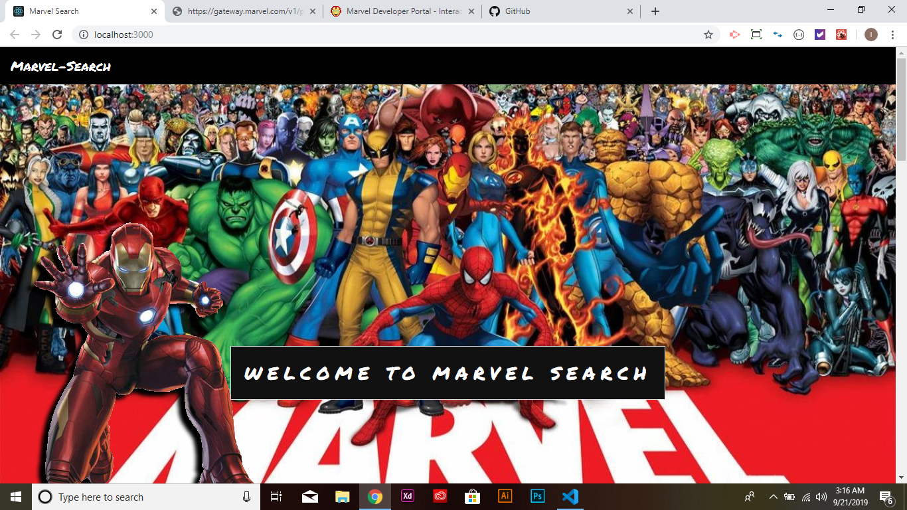
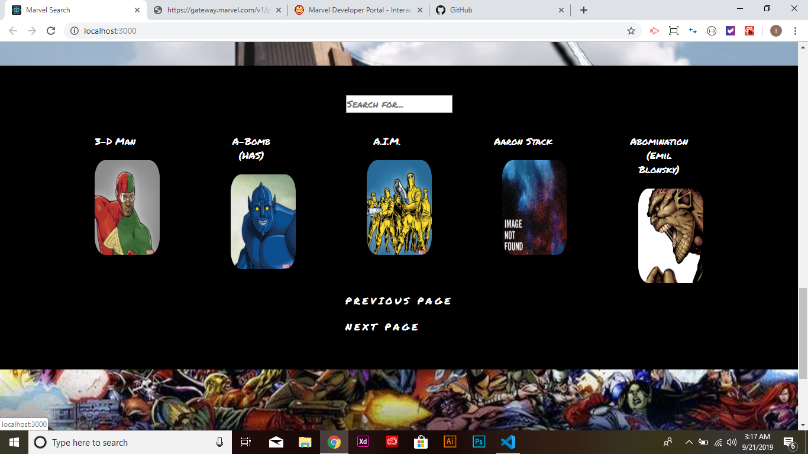
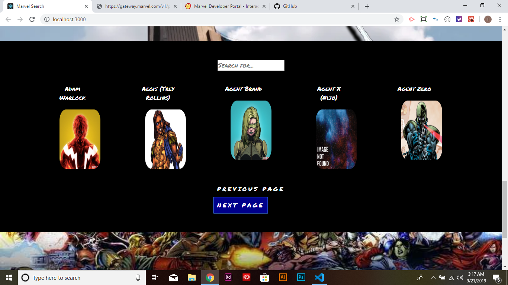
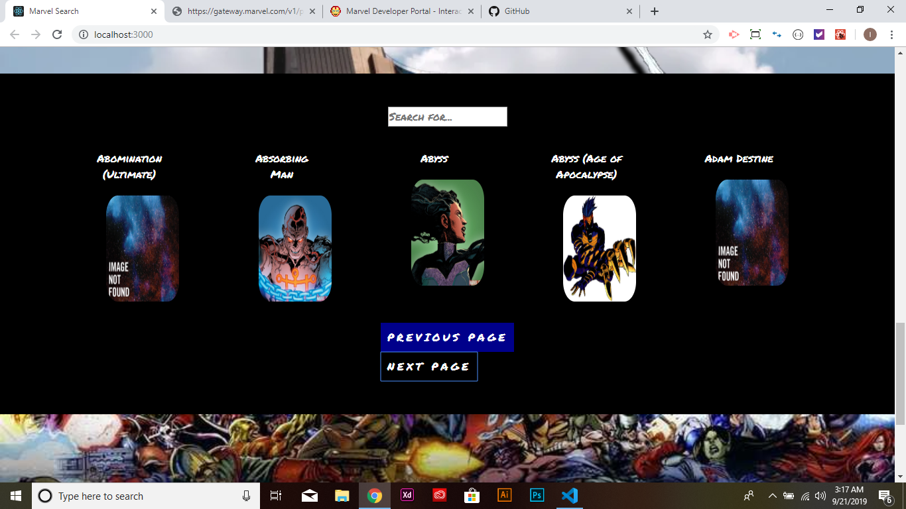

# MarvelSearch

Marvel Search is a web application that let's you search through different Marvel heros that were created.

# How To Use Marvel Search
1. First step is you Open Bash in the marvel-search-app.
2. Next, you type npm start to start the application.
3. After that, you will be introduce to the web application.

4. As you keep scrolling you will get to the Heroes section.

5. To look for more heroes just press the next button.

6. Then to go back press the previous.

# Files Used
- .env
- .gitignore
- React JS
- package.json
- package-lock.json

# Creator of App
Israel Harvin 9/17/2019
